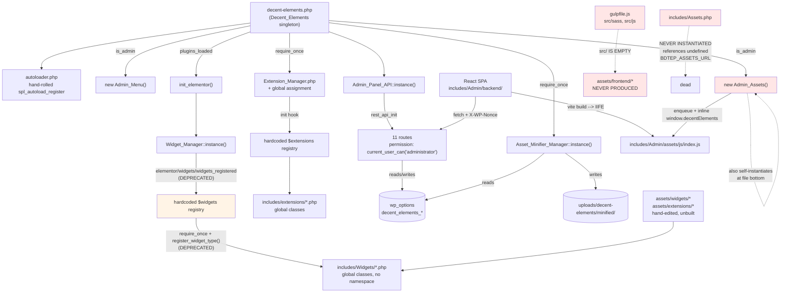
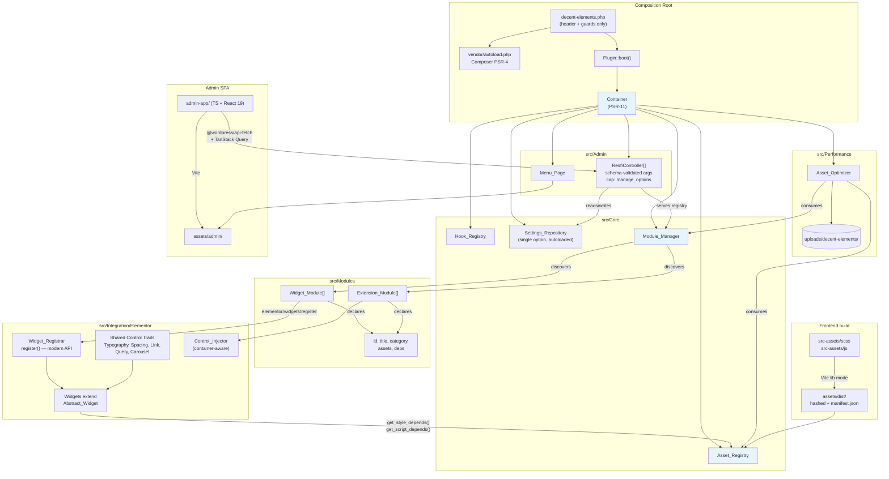

# Decent Elements — Architecture Audit & Modernization Roadmap

**Audit date:** 2026-08-11
**Branch:** `refactor/architecture-modernization`
**Auditor scope:** full plugin source, excluding `node_modules/` and `includes/Admin/optimizer/vendor/`
**Environment observed:** PHP 8.4.13 CLI, WordPress plugin folder inside a full WP install, Elementor addon

---

## 0. Executive summary

The plugin works, but it is a **prototype that grew without a spine**. There is no single composition root, no dependency graph, no build pipeline feeding the frontend assets, and no enforcement layer. Three separate refactors were started and none finished, leaving the codebase in a state where roughly **40% of the PHP is dead or duplicated code** and **45% of translatable strings are untranslatable** because they carry a boilerplate text domain.

The good news: the *conceptual* architecture is sound. Registry-driven widget/extension managers, a REST-backed React admin, and an asset optimizer are the right building blocks for an Elementor addon. The problem is execution — each block was built in isolation, wired ad-hoc, and never reconciled.

### Headline numbers

| Metric | Value | Comment |
|---|---|---|
| Plugin PHP (excl. vendor) | ~19,700 lines | |
| Duplicated widget code | ~5,600 lines | `posts.php` + `posts/posts.php` are byte-identical bar the class name |
| Dead widget files (never registered) | 7 files, ~3,300 lines | `fancy-heading`, `member`, `testimonials`, `image-gallery`, `Info-box`, plus dir-variants |
| Strings with wrong text domain | 662 of 1,334 (49.6%) | `_pltdomain` ×565, `genesis-core` ×88, `elementskit-lite` ×6, `foliocrave-core` ×1, `textdomain` ×2 |
| `error_log()` calls in production paths | 31 | Fires on every admin REST request |
| Files tracked in git | 23,262 | of which **23,094 are `node_modules`** (99.3%) |
| Gulp source files (`src/`) | **0** | The entire frontend build pipeline has no inputs |
| Root `composer.json` | **absent** | PSR-4 is hand-rolled in `autoloader.php` |
| PHP syntax errors under 8.4 | 0 | Lint sweep clean under 8.4; floor set to 8.0 in Phase 0 |

### The five things that matter most

1. **Finish or revert the abandoned widget migration.** Someone began moving widgets from `includes/Widgets/<name>.php` to `includes/Widgets/<name>/<Name>.php` with clean class names. The registry still points at the old flat files, so the new directory versions — including a `button` widget 3.5× more developed than the live one — are dead weight that will silently rot.
2. **Fix the text domain.** Half your UI cannot be translated. This is a release blocker for any commercial addon and a one-time mechanical fix.
3. **Introduce Composer + PSR-4 + a real DI container.** Everything else in this document depends on having a composition root.
4. **Purge `node_modules` from git.** 99.3% of the repo is vendored dependencies. Every clone, every diff, every `git log` pays for this.
5. **Adopt Elementor's modern registration API.** `elementor/widgets/widgets_registered` and `register_widget_type()` are both deprecated and will be removed.

---

## 1. Current architecture

### 1.1 As-built diagram



### 1.2 Folder structure as-is

```
decent-elements/
├── decent-elements.php          # 348 lines: bootstrap + constants + asset registration + admin notices
├── autoloader.php               # hand-rolled PSR-4, no composer
├── debug-assets.php             # ⚠ standalone script, requires wp-load.php directly
├── gulpfile.js                  # ⚠ reads from src/ which is empty
├── package.json                 # ⚠ ThemeCrave boilerplate metadata (name/prefixes wrong)
├── src/                         # ⚠ EMPTY
├── assets/
│   ├── css/, js/                # hand-edited, overlaps with assets/widgets/
│   ├── widgets/{css,js}/        # per-widget assets
│   ├── extensions/js/           # ⚠ de-* prefixed; optimizer looks for un-prefixed
│   └── vendors/gsap/            # committed third-party libs
└── includes/
    ├── Assets.php               # ⚠ DEAD — undefined constant, never instantiated
    ├── Widget_Manager.php       # registry, deprecated Elementor hooks
    ├── Extension_Manager.php    # registry + $GLOBALS assignment
    ├── Traits/Posts_Query.php   # ⚠ hardcoded 'bizzcrave_footer', 'bc-header' post types
    ├── Widgets/
    │   ├── heading.php          # LIVE (registered)
    │   ├── heading/heading.php  # ⚠ DEAD duplicate (identical bar class name)
    │   ├── posts.php            # LIVE, 3,439 lines
    │   ├── posts/posts.php      # ⚠ DEAD duplicate, 3,439 lines
    │   ├── button.php           # LIVE, 369 lines
    │   ├── button/button.php    # ⚠ DEAD, 1,303 lines — MORE developed than live version
    │   ├── icon-box.php         # LIVE, 1,378 lines
    │   ├── icon-box/Icon-box.php# ⚠ DEAD, 1,380 lines, diverged
    │   ├── fancy-heading/, member/, testimonials/   # ⚠ never registered
    │   └── image-gallery/, Info-box/                # ⚠ empty stubs (6 bytes)
    ├── extensions/              # 7 global-class extensions
    └── Admin/
        ├── Admin_Menu.php, Admin_Assets.php, Admin_Panel_API.php
        ├── optimizer/           # own composer.json + committed vendor/
        ├── assets/js/           # Vite build output
        └── backend/             # React 19 + Vite + Tailwind 4 SPA
```

---

## 2. Issues and risks

Severity: **P0** = fix before next release · **P1** = fix this quarter · **P2** = fix during refactor · **P3** = nice to have

### 2.1 Correctness bugs

| # | Sev | Issue | Location | Impact |
|---|---|---|---|---|
| C1 | **P0** | `\Elementor\Plugin::$instance->documents->get($post->ID)` can return `false`; `->is_built_with_elementor()` is called on it unguarded | `decent-elements.php:237`, `Asset_Minifier_Manager.php:430` | **Fatal error** on any page where the post ID has no document (attachments, some CPTs, revisions) |
| C2 | **P0** | Optimizer looks for extension assets at `assets/extensions/js/{extension_id}.js` but the files are named `de-{name}.js` and the IDs are `decent-elements-scroll-effects` | `Asset_Minifier_Manager.php:161` | Extension assets are **never** bundled. The optimizer silently under-delivers |
| C3 | **P1** | `includes/Assets.php` references undefined constant `BDTEP_ASSETS_URL` and calls `$this->is_widget_enabled()` which does not exist on the class | `Assets.php:63,66,60` | Latent fatal — currently masked only because nothing instantiates the class |
| C4 | **P1** | `Admin_Panel_API::get_extension_settings()` tries to `require` `includes/class-extension-manager.php` — a file that does not exist | `Admin_Panel_API.php:275,333` | Dead fallback path; masks the real failure mode if the manager is genuinely missing |
| C5 | **P1** | `Admin_Assets` is instantiated twice: once in the bootstrap, once at the bottom of its own file | `Admin_Assets.php:84`, `decent-elements.php:62` | Double object construction; only WP's callback dedup prevents double enqueue |
| C6 | **P2** | Widget asset for `animated-testimonials` is registered from `assets/css/` in the bootstrap but the optimizer reads `assets/widgets/css/` | `decent-elements.php:268` vs `Asset_Minifier_Manager.php:143` | Two copies of the same asset; they will drift |
| C7 | **P2** | `should_load_optimized_assets()` returns `true` for home, front page, all archives, and all searches, plus any post whose content merely contains the substring `elementor` | `Asset_Minifier_Manager.php:388-414` | Bundle loads on pages with zero plugin widgets — the optimizer *costs* performance on content-heavy sites |
| C8 | **P2** | `Posts_Query` trait hardcodes `bizzcrave_footer` and `bc-header` post types to skip | `Traits/Posts_Query.php:40` | Leaked from a different product; wrong behaviour for every other site |

### 2.2 Security

| # | Sev | Issue | Location |
|---|---|---|---|
| S1 | **P0** | REST permission callback is `current_user_can('administrator') \|\| current_user_can('manage_woocommerce')`. `'administrator'` is a **role**, not a capability — this is the classic WP anti-pattern. It fails on multisite super admins and on sites with custom roles, and `manage_woocommerce` grants plugin-settings write access to **shop managers** | `Admin_Panel_API.php:451` |
| S2 | **P0** | 31 `error_log()` calls dump full settings arrays and user IDs on every admin API call, unconditional on `WP_DEBUG` | throughout `Admin_Panel_API.php` |
| S3 | **P0** | `debug-assets.php` bootstraps WordPress directly (`require_once('../../../wp-load.php')`), performs **no capability check**, and calls `force_regenerate_assets()` | `debug-assets.php` — **must be deleted** |
| S4 | **P1** | Nonce, REST root, and base URL are echoed into an inline `<script>` with bare `echo`, no escaping, no `wp_add_inline_script`/`wp_localize_script` | `Admin_Assets.php:44-46, 67-69` |
| S5 | **P1** | Custom CSS extension outputs user-supplied CSS through `wp_strip_all_tags()` only — that strips tags but not CSS payloads (`expression()`, `url(javascript:)`, `@import`) | `extensions/custom-css.php:33,44` |
| S6 | **P1** | Unescaped widget output: `echo $settings['description']`, `echo $settings['box_title']` in `alt=`, `echo $settings['text']`, raw `$settings['icon_shape_image']['url']` in `src=` | `Widgets/icon-box.php:1322,1345`, `Widgets/button/button.php:1291` |
| S7 | **P2** | No `register_rest_route` `args` schemas — every endpoint accepts arbitrary params and validates by hand (or not at all, for `/settings/optimization`) | `Admin_Panel_API.php` |
| S8 | **P2** | Custom Cursor extension loads GSAP from `cdnjs.cloudflare.com` — third-party CDN dependency, no SRI, breaks air-gapped/GDPR-strict installs. A local copy already exists in `assets/vendors/gsap/` | `extensions/custom-cursor.php:56` |
| S9 | **P2** | `registered_settings()` returns options prefixed `my_plugin_` — boilerplate leftovers. The `/settings` GET/POST endpoints read and write options that belong to no feature | `Admin_Panel_API.php:136` |
| S10 | **P3** | Minified bundles written to `uploads/` with no `index.php` guard or `.htaccess` | `Asset_Minifier_Manager.php:220,264` |

### 2.3 Architecture & maintainability

| # | Sev | Issue |
|---|---|---|
| A1 | **P0** | **No composition root.** `decent-elements.php` mixes constant definition, admin bootstrapping, Elementor version gating, admin notices, *and* 60 lines of hardcoded asset registration in one 348-line class. |
| A2 | **P0** | **Abandoned migration.** Two parallel widget layouts coexist. `Widget_Manager` registers only the flat files. `button/button.php` (1,303 lines) is a substantially richer implementation than the registered `button.php` (369 lines) — real work is stranded. |
| A3 | **P0** | **49.6% of strings use a wrong text domain.** `_pltdomain` (565), `genesis-core` (88), `elementskit-lite` (6), `foliocrave-core` (1), `textdomain` (2). Also, the plugin never calls `load_plugin_textdomain()`. |
| A4 | **P1** | **Global classes.** Every widget and extension is an unnamespaced global class loaded by `require_once`. Collision risk with any other addon; no autoloading; no static analysis. |
| A5 | **P1** | **Hardcoded registries.** Adding a widget requires editing `Widget_Manager.php`, creating the file, *and* editing `backend/src/data/widgets.json` — three places, no single source of truth. The JSON is already out of sync with the PHP registry. |
| A6 | **P1** | **Singletons everywhere, DI nowhere.** `Widget_Manager`, `Extension_Manager`, `Admin_Panel_API`, `Asset_Minifier_Manager`, `Assets` are all singletons. `Extension_Manager` additionally publishes itself into `$GLOBALS` and defines a global function. Untestable, unmockable. |
| A7 | **P1** | **No build pipeline for frontend assets.** `src/` is empty; gulp has no inputs. `assets/widgets/css/*.css` and `assets/**/*.js` are hand-edited artefacts committed to the repo. There is no SCSS, no minification, no source maps for the actual shipped assets. |
| A8 | **P1** | **`node_modules` in git.** 23,094 of 23,262 tracked files. `.gitignore` has a malformed final line (`node_modules/node_modules`, no trailing newline) which is why the root `node_modules/` is still tracked. |
| A9 | **P2** | **Path casing inconsistency.** `DECENT_ELEMENTS_ABSPATH . 'includes/widgets/'` and `DECENT_ELEMENTS_URL . 'includes/admin/assets/js/index.js'` — real directories are `Widgets` and `Admin`. Works on macOS, **breaks on Linux production**. `App.jsx` imports `@/pages/General` against a `src/Pages/` directory — same class of bug in JS. |
| A10 | **P2** | **Nested vendor tree.** `includes/Admin/optimizer/` has its own `composer.json` and committed `vendor/`, isolated from a (nonexistent) root Composer setup. |
| A11 | **P2** | **No return types, no parameter types, no `declare(strict_types=1)`** anywhere in the plugin's own PHP. Targeting PHP 8.0 while writing PHP 5.6-era code. |
| A12 | **P2** | **Widget god-objects.** `posts.php` is 3,439 lines in a single class; `icon-box.php` is 1,378. Controls, rendering, and query logic are all inlined. |
| A13 | **P3** | **No tests, no CI, no static analysis, no coding standard.** The `.gitignore`, `package.json` metadata, and `README-TESTIMONIALS.md` (0 bytes) all point at an absent release process. |

### 2.4 Elementor-specific

| # | Sev | Issue |
|---|---|---|
| E1 | **P0** | `elementor/widgets/widgets_registered` is deprecated → use `elementor/widgets/register`. `$widgets_manager->register_widget_type()` is deprecated → use `->register()`. Both scheduled for removal. |
| E2 | **P1** | `add_elementor_widget_categories()` uses a `Closure::call()` hack to overwrite the private `$categories` property on `Elements_Manager` in order to *prepend* the category. This reaches into Elementor internals and will break without warning. Use `add_category()` and accept ordering, or use the documented filter. |
| E3 | **P1** | Widgets do not consistently declare `get_style_depends()` / `get_script_depends()`. Only `heading`, `animated-testimonials`, and `posts` do. Everything else relies on the bootstrap's blanket enqueue, defeating Elementor's per-widget conditional loading. |
| E4 | **P1** | The bootstrap's `enqueue_widget_assets()` enqueues `de-animated-testimonials` **unconditionally** on every Elementor page, regardless of whether the widget is present or even enabled. |
| E5 | **P2** | No `Elementor\Plugin::$instance->experiments` checks; no declared support for the Containers/Flexbox era. Extensions hook `elementor/element/section/...` and `elementor/element/column/...` — legacy structures — as well as `container`. Section/column will be deprecated. |
| E6 | **P2** | No shared control groups. Every widget redefines its own typography/spacing/border control sets inline, which is the main driver of the 3,400-line widget files and of editor sluggishness. |
| E7 | **P2** | No `get_upsale_data()`, no `get_custom_help_url()`, no widget `get_icon()` consistency — minor, but they are the polish signals reviewers look for. |
| E8 | **P3** | Extensions register controls on `common/_section_style/after_section_end` without checking element type, so controls appear on every widget including third-party ones. |

### 2.5 Admin panel (React)

| # | Sev | Issue |
|---|---|---|
| R1 | **P1** | JSX with a `tsconfig.json` that has `"files": []` and no `include` — TypeScript is configured but compiles nothing. All source is `.jsx`, two stray `.tsx`/`.ts` files exist (`ui/button.tsx`, `ui/drawer.tsx`, `ui/select.tsx`, `lib/utils.ts`). Half-migrated. |
| R2 | **P1** | Duplicate components: `ui/Button.jsx` **and** `ui/button.tsx`; `components/WidgetCard.jsx` **and** `components/widgets/WidgetItem.jsx`. |
| R3 | **P1** | Every page hand-rolls `fetch` with `X-WP-Nonce`, its own loading/error state, and its own `apiBase` fallback string. No shared API client, no request cancellation, no caching. |
| R4 | **P2** | `package.json` still named `vite-project`, version `0.0.0`. |
| R5 | **P2** | Dev-server port `5178` is hardcoded in both `vite.config.js` and `Admin_Assets.php`; the dev switch is a `define()` edit in the plugin's main file, which is easy to ship accidentally set to `true`. |
| R6 | **P2** | Data lives in `src/data/widgets.json`, a static file that must be kept in sync by hand with the PHP registry. It already has categories (WooCommerce, Marketing, Navigation) with no corresponding widgets. |
| R7 | **P3** | No i18n in the React app despite `wp-i18n` being declared as a script dependency. |

---

## 3. Proposed architecture

### 3.1 Principles and the reasoning behind them

**1. One composition root, zero singletons.**
*Why:* Singletons are the single biggest obstacle to testing this plugin. Today, `Asset_Minifier_Manager` reaches out to `Widget_Manager::instance()` and `Decent_Elements_Extension_Manager::instance()` directly — you cannot test the optimizer without a live WordPress with real options. A container that constructs objects once and injects them turns every one of those into a constructor parameter you can substitute. WordPress itself gives you nowhere to inject, so the plugin file becomes the composition root and everything below it receives its dependencies.

**2. Modules, not "widgets and extensions".**
*Why:* The current split is arbitrary. A "widget" is a thing that registers with Elementor's widget manager; an "extension" is a thing that hooks Elementor's control system. Both are *features that can be toggled, that own assets, and that need conditional loading*. Modelling them as one `Module` contract with two implementations collapses `Widget_Manager` and `Extension_Manager` — currently ~410 lines of near-identical registry/settings/toggle code — into one manager plus two thin adapters.

**3. Discovery over hardcoded registries.**
*Why:* Three-places-to-edit is why `widgets.json` is already out of sync. A widget should declare its own metadata (`id`, `title`, `category`, `assets`, `default_enabled`) as static methods on its class; the manager discovers classes and builds the registry. The REST API then serves the *same* registry to the React app, so `widgets.json` disappears entirely.

**4. Assets are declared by the module that owns them.**
*Why:* Right now asset registration is split across `decent-elements.php` (60 lines of hardcoded `wp_register_style` calls), each extension's own `enqueue_scripts()`, and the optimizer's path-guessing. Three places compute asset paths using three different conventions, which is exactly why bug C2 exists. If a module returns `['css' => ['heading'], 'js' => ['heading']]`, then the registrar, the optimizer, and Elementor's `get_style_depends()` all read from one source.

**5. PHP 8.0 as the floor.**
*Why:* The header said `Requires PHP: 7.3`; the floor is now **8.0** (set in Phase 0). 8.0 is the pragmatic choice for a distributed WordPress plugin — it still covers roughly the entire installed base that any commercial addon can reach, while unlocking the features that actually matter for this refactor: **constructor property promotion** (the single biggest boilerplate cut in the manager/DI layer), union types, `match`, the nullsafe operator, named arguments, and `static` return types.

What 8.0 does *not* give us, and the workarounds used in this plan:
- **No enums** (8.1) → module state stays as class constants on `Contracts\Module`.
- **No `readonly` properties** (8.1) → value objects use private promoted properties with getters.
- **No first-class callable syntax** (8.1) → hook registration uses `[$this, 'method']` arrays, as today.
- **No `#[\Override]`** (8.3) → rely on PHPStan to catch signature drift instead.

None of these are blocking. The code lints clean under PHP 8.4, so the ceiling is open whenever the floor is raised later.

**6. Escape at output, validate at the boundary.**
*Why:* The current code sanitizes inconsistently and escapes rarely. The fix is not "add `esc_html` everywhere" but to make the boundaries explicit: REST `args` schemas validate on the way in, a `View`/render helper escapes on the way out, and PHPCS enforces both mechanically so it cannot regress.

### 3.2 Target diagram



### 3.3 Target folder structure

```
decent-elements/
├── decent-elements.php              # header, PHP/WP/Elementor guards, require autoload, Plugin::boot()
├── composer.json                    # PSR-4: Decent_Elements\ => src/
├── composer.lock
├── package.json                     # workspaces: admin-app, frontend assets
├── phpcs.xml.dist                   # WPCS + custom sniffs
├── phpstan.neon.dist                # level 6 -> 8
├── .eslintrc / eslint.config.js
├── .prettierrc
├── .editorconfig
├── .gitattributes                   # export-ignore for dev files
├── .github/workflows/ci.yml
│
├── src/                             # ALL plugin PHP, namespaced, autoloaded
│   ├── Plugin.php                   # composition root
│   ├── Core/
│   │   ├── Container.php            # PSR-11
│   │   ├── Service_Provider.php     # interface
│   │   ├── Hookable.php             # interface: register_hooks(): void
│   │   ├── Settings_Repository.php  # ONE autoloaded option, typed accessors
│   │   ├── Asset_Registry.php       # manifest-aware register/enqueue
│   │   └── Module_Manager.php
│   ├── Contracts/
│   │   ├── Module.php               # id, title, category, is_default_enabled, assets
│   │   ├── Widget_Module.php
│   │   └── Extension_Module.php
│   ├── Integration/Elementor/
│   │   ├── Elementor_Provider.php
│   │   ├── Widget_Registrar.php     # elementor/widgets/register
│   │   ├── Category_Registrar.php
│   │   ├── Abstract_Widget.php      # base: assets, category, escaping helpers
│   │   └── Controls/                # SHARED, reusable control groups
│   │       ├── Has_Typography.php
│   │       ├── Has_Query_Controls.php
│   │       ├── Has_Carousel_Controls.php
│   │       └── Has_Link_Controls.php
│   ├── Modules/
│   │   ├── Heading/
│   │   │   ├── Heading_Widget.php   # controls
│   │   │   ├── Renderer.php         # markup (testable, no Elementor coupling)
│   │   │   └── views/heading.php
│   │   ├── Posts/
│   │   │   ├── Posts_Widget.php
│   │   │   ├── Post_Query_Builder.php   # extracted from the 3,439-line god-object
│   │   │   ├── Renderer.php
│   │   │   └── views/
│   │   ├── Button/ Icon_Box/ Image_Box/ Testimonials/ ...
│   │   └── Extensions/
│   │       ├── Custom_Cursor/ Sticky_Column/ Wrapper_Link/ ...
│   ├── Admin/
│   │   ├── Admin_Provider.php
│   │   ├── Menu_Page.php
│   │   └── Rest/
│   │       ├── Abstract_Controller.php   # permission + schema helpers
│   │       ├── Modules_Controller.php
│   │       ├── Settings_Controller.php
│   │       └── Optimization_Controller.php
│   ├── Performance/
│   │   ├── Asset_Optimizer.php
│   │   └── Conditional_Loader.php    # decides per-request what to enqueue
│   └── Support/
│       ├── View.php                  # escaping-by-default template renderer
│       └── Str.php
│
├── src-assets/                       # SOURCE for frontend assets (currently missing entirely)
│   ├── scss/
│   │   ├── modules/heading.scss ...
│   │   └── shared/_mixins.scss
│   └── js/
│       └── modules/heading.js ...
├── assets/
│   ├── dist/                         # BUILT, hashed, + manifest.json  (gitignored? no — shipped, but not source)
│   ├── admin/                        # built SPA
│   └── vendor/gsap/                  # local GSAP (replaces CDN)
│
├── admin-app/                        # React 19 + TypeScript SPA
│   ├── src/
│   │   ├── api/client.ts             # ONE api-fetch wrapper
│   │   ├── api/queries.ts            # TanStack Query hooks
│   │   ├── components/ui/            # one canonical set (shadcn)
│   │   ├── features/{modules,optimizer,settings}/
│   │   └── types/                    # generated from PHP REST schemas
│   └── vite.config.ts
│
├── languages/decent-elements.pot
├── tests/
│   ├── Unit/                         # PHPUnit, no WP
│   └── Integration/                  # wp-env + WP test suite
└── docs/
    ├── ARCHITECTURE-AUDIT.md         # this file
    ├── CONTRIBUTING.md
    └── adr/                          # architecture decision records
```

**Why `src/` and not `includes/`:** Composer's PSR-4 convention, and it frees the name `includes` — but more importantly, moving the directory forces every `require_once` to be deleted rather than quietly left behind. A rename is a forcing function.

**Why one option row instead of five:** Currently `decent_elements_widget_settings`, `decent_elements_extension_settings`, `decent_elements_enable_asset_optimization`, `decent_elements_settings_last_updated`, `decent_elements_assets_optimized`, `decent_elements_last_optimization`, `decent_elements_minified_js_generated`, `decent_elements_minified_css_generated` are eight separate `get_option()` calls. On a cold cache that is eight queries per page load. One autoloaded option is one row in the alloptions cache, zero extra queries.

**Why `Renderer` classes separate from widgets:** `Widget_Base` is impossible to instantiate outside Elementor. Splitting markup generation into a plain class that takes an array and returns a string makes the output — the part with the escaping bugs — unit-testable without WordPress.

---

## 4. Refactoring strategy

Strictly ordered. Each phase leaves the plugin working and shippable.

### Phase 0 — Stop the bleeding (1 day, no architecture change)

| Task | Rationale |
|---|---|
| Delete `debug-assets.php` | S3 — unauthenticated WP bootstrap |
| Delete `includes/Assets.php` | C3 — dead, would fatal |
| Delete the 7 dead widget files/dirs **after** salvaging `button/button.php` and `icon-box/Icon-box.php` into their live counterparts | A2 — but *do not* delete before you diff and salvage |
| Fix `.gitignore` (`node_modules/` on its own line, trailing newline) and `git rm -r --cached node_modules` | A8 |
| Guard `documents->get()` return before `is_built_with_elementor()` | C1 — live fatal |
| Wrap all `error_log()` in `if (defined('WP_DEBUG') && WP_DEBUG)` or delete | S2 |
| Change REST permission to `current_user_can('manage_options')` | S1 |
| Remove `new Admin_Assets()` from the bottom of `Admin_Assets.php` | C5 |
| Replace inline `<script>` with `wp_add_inline_script` + `wp_json_encode` | S4 |
| Global find/replace text domains → `decent-elements`, add `load_plugin_textdomain()` | A3 |

**Deliverable:** a plugin with no known fatal paths, no unauthenticated endpoints, and a repo you can clone in under a second.

### Phase 1 — Foundation (3–5 days)

1. Add root `composer.json`, PSR-4 `Decent_Elements\ => src/`, `require: php >= 8.0`. Fold the optimizer's `matthiasmullie/minify` into the root `require`; delete `includes/Admin/optimizer/{composer.json,vendor,autoload.php}`.
2. `git mv includes src`, fix every path constant and `require`. **Do this on Linux or with `core.ignorecase=false`** so the casing bugs (A9) surface.
3. Add `phpcs.xml.dist` (WordPress ruleset + `WordPress.Security.EscapeOutput`), `phpstan.neon.dist` at level 4. Add `composer lint`, `composer analyse`, `composer fix`.
4. Add `.github/workflows/ci.yml` running lint + analyse + `npm run build` on PHP 8.0, 8.3 and 8.4.
5. Introduce `src/Plugin.php` as the composition root and a minimal PSR-11 container. Move constant definition, version gating, and admin notices out of the plugin file into `Plugin` + a `Requirements` checker.

**Gate:** PHPCS passes at *warning* level on new code, PHPStan level 4 clean. CI green.

### Phase 2 — Module system (1–2 weeks)

1. Define `Contracts\Module`, `Widget_Module`, `Extension_Module`.
2. Build `Core\Module_Manager` with class discovery; keep the hardcoded array as a *fallback* for one release so nothing breaks.
3. Build `Core\Settings_Repository` over a single autoloaded option, with a one-time migration that reads the eight legacy options and writes the consolidated row. **Keep reading legacy options for two releases.**
4. Swap Elementor registration to `elementor/widgets/register` + `->register()` (E1). Replace the `Closure::call()` category hack with `add_category()` (E2).
5. Build `Core\Asset_Registry`: modules declare assets, registry registers them, widgets return them from `get_style_depends()`/`get_script_depends()` (E3). Delete the 60 lines of hardcoded registration and `enqueue_widget_assets()` (E4).

**Gate:** widget/extension enable-disable works identically; asset handles unchanged; one release of dual-read for settings.

### Phase 3 — Widget modernization (2–4 weeks, incremental per widget)

Per widget, in this order — `heading` (smallest, proves the pattern) → `button` → `icon-box` → `image-box` → `testimonials` → `posts` (largest, last):

1. Namespace it, extend `Abstract_Widget`.
2. Extract repeated control blocks into `Integration/Elementor/Controls/` traits (E6). This is where the 3,439-line `posts.php` collapses — most of it is control definitions duplicated from other widgets.
3. Extract markup into a `Renderer` + `views/*.php` template, escaping everything (S6).
4. For `posts`: extract `Post_Query_Builder`, de-`bizzcrave` the trait (C8).
5. Move the widget's CSS/JS into `src-assets/` and wire the Vite build.

**Gate per widget:** visual regression against a saved Elementor page; PHPCS `EscapeOutput` clean.

### Phase 4 — REST & admin app (1–2 weeks)

1. `Rest\Abstract_Controller` with a shared `permission_callback` (`manage_options`) and `args` schemas on every route (S7).
2. Split `Admin_Panel_API` (613 lines) into `Modules_Controller`, `Settings_Controller`, `Optimization_Controller`. Delete the `my_plugin_*` settings and the `get_posts`/`get_license` examples (S9).
3. Serve the module registry from PHP; delete `widgets.json` (A5/R6).
4. Migrate the SPA to TypeScript, one canonical `ui/` set (R1/R2), one `api/client.ts` on `@wordpress/api-fetch` + TanStack Query (R3).
5. Replace the `DECENT_ELEMENTS_DEV` constant with an env-driven check (`defined('WP_ENVIRONMENT_TYPE') && 'development' === wp_get_environment_type()`) plus a `.env`-read port (R5).

### Phase 5 — Performance & release (1 week)

1. Rewrite `Conditional_Loader`: enqueue per-widget assets only when Elementor reports the widget is on the page (`elementor/frontend/before_render` or the document's element cache). Fixes C7.
2. Fix the optimizer's extension path mismatch (C2) by consuming `Asset_Registry` instead of guessing paths.
3. Local GSAP (S8), `index.php` guards in the uploads dir (S10).
4. `.gitattributes` `export-ignore` + a `composer archive`/`wp dist-archive` release task replacing the gulp `compress` task.
5. Raise PHPStan to level 6, then 8 on `src/Core` and `src/Contracts`.

---

## 5. Performance recommendations

**Database.** Eight autoloaded-option reads collapse to one (§3.3). `decent_elements_settings_last_updated` is written on every settings save *and* read on every `admin_init` — move the regeneration trigger to a hook on the settings write instead of a poll.

**Asset loading.** The current model loads a widget's assets if the *post* is built with Elementor, not if the *widget is present*. Elementor 3.x already tracks which widgets a document uses; `get_style_depends()`/`get_script_depends()` on the widget class is the supported way to get per-widget conditional loading for free. Adopting it (E3) is the single largest frontend win available and it also makes the optimizer's aggressive `should_load_optimized_assets()` heuristic (C7) unnecessary.

**Editor responsiveness.** Elementor builds every control of every registered widget into the editor's JS payload. A 3,439-line `posts.php` with hundreds of controls is a measurable editor cost. Extracting shared control traits does not by itself reduce control *count*, so also: use `Controls_Manager::POPOVER_TOGGLE` for rarely-used groups, mark heavy sections `'condition'`-gated, and move purely-cosmetic controls behind `add_group_control` rather than individual controls.

**Bundle strategy.** The current optimizer produces one `de-scripts.js` + one `de-styles.css` for *all* enabled modules, then loads it on archives and search pages. That is worse than the unoptimized path on a blog. Replace with per-page bundling keyed on the set of widgets actually rendered, cached by that set's hash — or drop the optimizer entirely and rely on per-widget `get_*_depends()` plus the host's page cache, which is what modern Elementor addons do.

**Frontend JS.** `assets/js/*.js` are hand-written, unminified, jQuery-dependent, and shipped as-is. Building them through Vite in library mode with per-module entries gives minification, tree-shaking, and lets you drop the jQuery dependency (only `advanced-animations.js` and the GSAP integrations genuinely need a library, and GSAP is not jQuery).

---

## 6. Security checklist

Use this as the PR template checklist.

**Input**
- [ ] Every REST route declares `args` with `type`, `sanitize_callback`, `validate_callback`
- [ ] `permission_callback` is a **capability** (`manage_options`), never a role name
- [ ] No `permission_callback => '__return_true'` on any write route
- [ ] AJAX handlers (if added) use `check_ajax_referer()` with a specific action
- [ ] Elementor control values are treated as untrusted — editors are not necessarily admins

**Output**
- [ ] `esc_html()` for text, `esc_attr()` for attributes, `esc_url()` for URLs, `wp_kses_post()` for rich text
- [ ] `get_render_attribute_string()` output is Elementor-escaped — but the *values* passed in must be escaped first
- [ ] No `echo $settings[...]` without an escaping function (PHPCS `WordPress.Security.EscapeOutput` enforces this)
- [ ] Custom CSS sanitized with a real CSS sanitizer (`safecss_filter_attr` per-declaration, or strip `@import`/`expression`/`javascript:` explicitly), not `wp_strip_all_tags()`
- [ ] SVG upload/echo paths run through `wp_kses` with an SVG-safe allowlist

**Filesystem**
- [ ] Writes go through `WP_Filesystem`, not raw `file_put_contents`
- [ ] Generated paths are validated against the uploads basedir (no traversal from an option value)
- [ ] `index.php` and `.htaccess` guards in generated directories
- [ ] Recursive delete refuses to operate outside `wp_upload_dir()['basedir']`

**Secrets & logging**
- [ ] No `error_log()` of settings, user data, or IDs outside `WP_DEBUG`
- [ ] No `print_r`/`var_dump` reachable in production
- [ ] No standalone scripts that `require wp-load.php`

**Dependencies**
- [ ] Third-party JS served locally, not from a CDN
- [ ] `composer audit` in CI
- [ ] `npm audit --omit=dev` in CI

---

## 7. Elementor-specific improvements

| Area | Now | Target |
|---|---|---|
| Registration hook | `elementor/widgets/widgets_registered` | `elementor/widgets/register` |
| Registration call | `register_widget_type( new X() )` | `$manager->register( new X() )` |
| Category | `Closure::call()` on private `$categories` | `$elements_manager->add_category()` |
| Asset deps | Blanket enqueue in bootstrap | `get_style_depends()` / `get_script_depends()` per widget |
| Controls | Redefined inline per widget | Shared traits + `add_group_control` |
| Containers | Extensions hook `section`, `column`, `container` | `container` + `common`; drop section/column when Elementor does |
| Editor scripts | None | `elementor/editor/after_enqueue_scripts` for editor-only behaviour |
| Dynamic tags | None | Register dynamic tags for widget-relevant data |
| Experiments | Not consulted | Gate container-specific behaviour on `Plugin::$instance->experiments->is_feature_active()` |
| Version support | `>= 3.0.0` | `>= 3.24` (containers stable, modern registration mandatory), with a documented policy of supporting the last 12 months of Elementor releases |
| Widget base | Direct `Widget_Base` | `Abstract_Widget` providing category, escaping helpers, asset declaration |

---

## 8. Developer workflow

**Tooling to add**

```
composer.json scripts:
  lint      -> phpcs --standard=phpcs.xml.dist
  fix       -> phpcbf --standard=phpcs.xml.dist
  analyse   -> phpstan analyse --memory-limit=1G
  test      -> phpunit
  test:int  -> wp-env run tests-wordpress phpunit

package.json scripts (root workspace):
  dev       -> vite build --watch (frontend assets)
  dev:admin -> vite dev (admin SPA)
  build     -> npm run build:assets && npm run build:admin
  lint:js   -> eslint . --max-warnings 0
  format    -> prettier --write .
  makepot   -> wp i18n make-pot . languages/decent-elements.pot
  release   -> npm run build && composer install --no-dev -o && wp dist-archive .
```

**Config files**

- `phpcs.xml.dist` — `WordPress` ruleset, `minimum_wp_version` 6.4, text domain `decent-elements` enforced by `WordPress.WP.I18n`, prefix `decent_elements`/`DECENT_ELEMENTS`/`Decent_Elements` enforced by `WordPress.NamingConventions.PrefixAllGlobals`. That last sniff alone would have caught A3 and A4.
- `phpstan.neon.dist` — `szepeviktor/phpstan-wordpress` + `php-stubs/elementor-stubs`. Start at level 4 (`src/` only), ratchet.
- `eslint.config.js` — `@wordpress/eslint-plugin` + `typescript-eslint` + `react-hooks`.
- `.prettierrc` — `@wordpress/prettier-config`.
- `.editorconfig` — tabs for PHP (WPCS), 2 spaces for JS/JSON. The codebase currently mixes tabs and 4-space indentation *within the same file* (`Widget_Manager.php`).
- `.gitattributes` — `export-ignore` for `tests/`, `admin-app/src/`, `src-assets/`, dotfiles.

**Git workflow**

- Trunk-based with short-lived branches; `main` always releasable.
- Conventional Commits → auto-generated `CHANGELOG.md` (also drives the `Stable tag` bump).
- CI matrix: PHP 8.0 / 8.3 / 8.4 × WP 6.5 / latest / trunk × Elementor latest / latest-1.
- Tag `v*` triggers a build + `wp dist-archive` + GitHub Release with the zip attached.

**Testing**

- Unit (PHPUnit, no WordPress): `Renderer` classes, `Post_Query_Builder`, `Settings_Repository` with an in-memory option store, `Module_Manager` discovery.
- Integration (`wp-env`): REST route permissions and schemas, settings migration, widget registration under a real Elementor.
- Visual regression: Playwright against a fixture Elementor page per widget. This is the only safe way to refactor a 3,439-line widget.

---

## 9. Migration plan

The constraint: **user data must survive, and every intermediate state must be shippable.**

### 9.1 Data migration

| Legacy | New | Strategy |
|---|---|---|
| `decent_elements_widget_settings` | `decent_elements_settings['modules']` | On upgrade, read legacy → merge → write consolidated. **Keep the legacy read as a fallback for 2 minor releases**, then drop. Do not delete the legacy option until then. |
| `decent_elements_extension_settings` | same key, same map | Extensions and widgets unify under `modules`. Namespace IDs (`widget:heading`, `extension:custom-cursor`) to avoid collisions — note `custom-cursor` already exists as an extension ID and `assets/css/custom-cursor.css` as a widget-dir asset. |
| `decent_elements_enable_asset_optimization` + 4 optimizer options | `decent_elements_settings['optimization']` | Same dual-read window. |
| Elementor page data (control values in `_elementor_data`) | unchanged | **Control IDs must not change.** If a control is renamed during Phase 3, ship an `elementor/element/parse_css` or `on_import` mapper. Safest path: do not rename controls. |

Migration runs on `plugins_loaded` behind a stored `db_version`, not on activation — activation hooks do not fire on plugin updates.

### 9.2 Sequencing rules

1. **Never rename an asset handle and change its content in the same release.** Handle renames break child themes that `wp_dequeue_style()` them.
2. **Never delete a widget class name without a shim.** `Decent_Elements_Heading_Widget` is stored in `_elementor_data` as the widget *name* (`de-heading`), not the class name — so class renames are safe, but `get_name()` return values are **frozen forever**. Verify each widget's `get_name()` is preserved verbatim through Phase 3.
3. **The `posts` widget goes last** and gets its own release. It is 17% of the plugin's PHP.
4. **One phase per release.** Phase 0 → 1.0.1, Phase 1 → 1.1.0, Phase 2 → 1.2.0, Phase 3 → 1.3.x (one widget per patch), Phase 4 → 1.4.0, Phase 5 → 2.0.0.

### 9.3 Rollback

Each phase is a squash-merged commit on `main` with a tag. Rollback = revert the merge + re-release. Because settings dual-read for two releases, a rollback never strands user data.

### 9.4 Salvage list (do this before any deletion)

Comparing `get_name()` across live and dead files (done in Phase 0) splits the retained
files into two very different categories. **`get_name()` is the identifier stored in
`_elementor_data`, so two files returning the same name are competing versions of one
widget, not two widgets.**

**Category A — competing rewrites of a shipped widget** (same `get_name()` as a live file).
Merging is a real decision with user-data implications: whichever wins must keep every
control ID the live version has, or existing pages lose their settings.

| Dead file | `get_name()` | Competes with | Size delta |
|---|---|---|---|
| `Widgets/button/button.php` (`Button`) | `de-button` | `Widgets/button.php` (369 lines) | dead file is **3.5× larger** |
| `Widgets/icon-box/Icon-box.php` (`Icon_Box`) | `de-icon-box` | `Widgets/icon-box.php` | 2,597 diff-lines, similar size |
| `Widgets/fancy-heading/fancy-heading.php` (`Fancy_Heading`) | `de-fancy-heading` | `Widgets/dual-color-heading.php` | dead file 480 lines |

> Note the naming trap: the live file is called `dual-color-heading.php` and its class is
> `Decent_Elements_Dual_Color_Heading_Widget`, but its `get_name()` returns
> **`de-fancy-heading`**. The registry key, the filename, the class name, and the widget
> name are four different strings. This is worth fixing in Phase 3 — but `get_name()`
> itself must never change.

**Category B — genuinely unshipped widgets** (unique `get_name()`, no live equivalent).
No merge conflict; the only decision is ship-or-delete.

| Dead file | `get_name()` | Notes |
|---|---|---|
| `Widgets/member/member.php` (`Member`) | `de-team` | 448 lines, complete. No live equivalent. |
| `Widgets/testimonials/testimonials.php` (`Testimonial`) | `de-testimonial` | 764 lines. Distinct from the live `de-animated-testimonials`. |

**Deleted in Phase 0** (verified safe):

| File | Reason |
|---|---|
| `Widgets/posts/`, `Widgets/heading/` | Byte-identical to live files bar the class name |
| `Widgets/image-gallery/`, `Widgets/Info-box/` | 6-byte empty stubs |

---

## 10. Future-proofing (3–5 years)

**Elementor's trajectory.** Elementor is moving toward Containers-only (sections/columns already legacy), an Atomic Widgets / v4 styling engine, and stricter widget registration. Concretely: build every new widget container-first, never assume `section`/`column` exist, keep `get_name()` values stable, and isolate all Elementor API contact inside `src/Integration/Elementor/` so a v4 migration touches one directory instead of every widget. The `Renderer` split is the insurance policy here — markup logic survives an Elementor API rewrite; `Widget_Base` subclasses may not.

**WordPress's trajectory.** Block themes, the Interactivity API, and PHP 8.4+. Two consequences: (1) an Elementor addon that can *also* expose its renderers as blocks doubles its market — the `Renderer` layer makes that a wrapper, not a rewrite; (2) the admin SPA should migrate from bespoke Radix components toward `@wordpress/components` where the two overlap, because that is the surface WordPress will keep supporting.

**PHP.** Target 8.3 now, plan for 8.5. Enums for module state, readonly promoted properties for value objects, `#[\Override]` on abstract implementations. Run PHPStan against `php-nightly` in a non-blocking CI job to catch deprecations a year early.

**Extensibility as a product feature.** Right now nothing about this plugin is extensible by third parties — no filters on the registry, no way to add a widget from a theme. A documented extension surface (`decent_elements/modules`, `decent_elements/widget/{id}/settings`, `decent_elements/assets/{handle}`) turns the plugin from a closed box into a platform, and it costs almost nothing once `Module_Manager` exists.

**Pro/free split.** If a commercial tier is ever planned, the module contract is the seam: a Pro plugin registers additional `Module` implementations into the same container. Design that seam now (a public `Module_Manager::register()` and a `decent_elements/container` filter) even if Pro never ships — retrofitting it later means re-touching every module.

**Operational.** Add a `Site_Health` integration reporting Elementor version, enabled module count, and optimizer state; it turns support tickets from guesswork into data. Add opt-in telemetry only if you will actually read it.

---

## Appendix A — Phase 0: COMPLETED

Executed on branch `refactor/architecture-modernization`. PHP floor set to **8.0**.

| # | Ref | Action | Status |
|---|---|---|---|
| 1 | S3 | `git rm debug-assets.php` — unauthenticated WP bootstrap | ✅ |
| 2 | C3 | `git rm includes/Assets.php` — dead, undefined `BDTEP_ASSETS_URL` | ✅ |
| 3 | A8 | Rewrote `.gitignore`; `git rm -r --cached node_modules` | ✅ 23,262 → 164 tracked files |
| 4 | C1 | Guarded `documents->get()` before `is_built_with_elementor()` | ✅ both sites, extracted to `is_built_with_elementor()` helper |
| 5 | S1 | `current_user_can('administrator') \|\| 'manage_woocommerce'` → `manage_options` | ✅ |
| 6 | S2 | 31 `error_log()` calls → 21 deleted, 10 routed through a `WP_DEBUG`-gated `log()` | ✅ 0 ungated remain |
| 7 | C5 | Removed trailing `new Admin_Assets();` | ✅ |
| 8 | S4 | `window.decentElements` → `wp_add_inline_script` + `wp_json_encode` | ✅ |
| 9 | A3 | Text domain sweep across 5 files | ✅ 662 replaced; 100% now `decent-elements` |
| 10 | A3 | `load_plugin_textdomain()` on `init` | ✅ |
| 11 | §9.4 | Salvage triage of dead widget dirs | ✅ analysed, **retained** — see §9.4 |
| 12 | A2 | Deleted confirmed-dead widget dirs | ✅ `posts/`, `heading/`, `image-gallery/`, `Info-box/` |

**Bug found during runtime verification and fixed:**

- `Widgets/posts.php:84` returned `['tc-elements']` from `get_categories()` — another
  leaked ThemeCrave boilerplate string, and a category the plugin never registers. The
  Posts widget was therefore filed under an orphan category in the Elementor panel
  instead of alongside the other six. Changed to `['decent-elements']`; all 7 widgets now
  verify into the correct category. This was invisible to static review — only
  instantiating the widgets against a live Elementor surfaced it.

**Opportunistic fixes made while editing the same lines:**

- Path casing `includes/admin/assets/js/index.js` → `includes/Admin/assets/js/index.js` (partial A9 — this one would have 404'd on Linux).
- Removed a dev-mode `wp_enqueue_script_module()` call pointing at `src/main.js`, which does not exist (the entry is `main.jsx`) and was redundant with the module tag printed two lines later.
- Hardcoded version strings `'7.3'` / `'3.0.0'` replaced with `MINIMUM_PHP_VERSION` / `MINIMUM_ELEMENTOR_VERSION` class constants, so the guard and its admin notice can no longer disagree.

**Deliberately NOT done in Phase 0** (deferred, with reasons):

| Ref | Item | Why deferred |
|---|---|---|
| §9.4 | Merging `button/`, `icon-box/`, `fancy-heading/` forward | Category A competing rewrites — same `get_name()`, so a bad merge silently drops control values from live pages. Needs visual-regression cover first (Phase 3). |
| §9.4 | Shipping `member/` (`de-team`), `testimonials/` (`de-testimonial`) | Product decision, not a cleanup. |
| C4 | Dead `require` of nonexistent `includes/class-extension-manager.php` | Harmless (`file_exists` guard). Removed with the manager rewrite in Phase 2. |
| S9 | `my_plugin_*` boilerplate settings + `get_posts`/`get_license` examples | Deleting REST routes is a behaviour change; belongs with the controller split in Phase 4. |
| A9 | Remaining lowercase `includes/widgets/` path in `Widget_Manager` | Fixed wholesale by the `includes/` → `src/` move in Phase 1. |
| E1/E2 | Deprecated Elementor registration + `Closure::call()` category hack | Verified still functional on Elementor 4.0.2 (see below). Phase 2. |

**Runtime verification** (WP-CLI against the live install, not just linting):

```
bootstrap: OK
MIN_PHP:   8.0
textdomain hook: registered
permission (anonymous): false     <- was true for any user with manage_woocommerce
permission (admin):     true
widgets in registry:    7
de-* widgets registered under Elementor 4.0.2: 7
  de-heading, de-fancy-heading, de-image-box, de-icon-box,
  de-button, de-animated-testimonials, de-posts
```

> **Environment note:** the install runs **Elementor 4.0.2**, newer than this audit
> originally assumed. `register_widget_type()` and `elementor/widgets/widgets_registered`
> are both still present and functional there, so E1 is a deprecation to schedule, not a
> live breakage. This does raise the priority of Phase 2 — v4 is where removal becomes
> plausible.

## Appendix A2 — Phase 1: COMPLETED

Foundation laid: Composer, PSR-4, composition root, enforcement tooling, CI.

| # | Action | Result |
|---|---|---|
| 1 | Root `composer.json`, PSR-4 `Decent_Elements\ => src/`, `php >= 8.0`, `config.platform.php = 8.0.30` | ✅ |
| 2 | Folded `matthiasmullie/minify` into root Composer; deleted `src/Admin/Optimizer/{composer.json,composer.lock,vendor,autoload.php}` | ✅ nested vendor tree gone |
| 3 | `includes/` → `src/`; every path constant and `require` rewritten | ✅ 0 `includes/` references remain |
| 4 | Renamed `Admin/optimizer` → `Admin/Optimizer` to match its namespace | ✅ PSR-4 is case-sensitive; this was required |
| 5 | Deleted hand-rolled `autoloader.php`; Composer autoload with `exclude-from-classmap` for `node_modules` | ✅ |
| 6 | New `src/Core/Container.php`, `src/Core/Requirements.php`, `src/Frontend/Asset_Loader.php`, `src/Plugin.php` | ✅ |
| 7 | `decent-elements.php`: 348 lines → **57**, now header + autoload guard + `Plugin::boot()` | ✅ |
| 8 | `phpcs.xml.dist` (WPCS + PHPCompatibilityWP, `testVersion 8.0-`) | ✅ **0 errors** on new code |
| 9 | `phpstan.neon.dist` at level 4 | ✅ **0 errors** |
| 10 | `.github/workflows/ci.yml` — PHP 8.0/8.3/8.4 + admin-app build + case-sensitivity guard | ✅ |

**Why no `psr/container`:** bundling PSR interfaces into a WordPress plugin risks a fatal
class-redeclaration when another plugin bundles a different version into the same request.
The container's contract is four methods; the interface bought nothing worth that risk.

### Bugs the new tooling found immediately

**1. The extension-manager fallback chain was entirely dead (PHPStan, level 4).**
`Admin_Panel_API` tried three ways to reach the extension manager. The class lives in the
`Decent_Elements` namespace, but the checks were:

```php
function_exists('Decent_Elements_Extension_Manager')          // string → GLOBAL namespace → always false
class_exists('Decent_Elements_Extension_Manager')             // string → GLOBAL namespace → always false
Decent_Elements_Extension_Manager::instance()                 // unqualified → Decent_Elements\Admin\… → does not exist
```

Only the first branch (`$GLOBALS`) ever fired. Had that global ever been unset, the
endpoint would have returned a 500 rather than recovering. Replaced all three with one
fully-qualified call. **Static analysis caught this on its first run.**

**2. The case-sensitivity CI guard found `assets/extensions/css/` does not exist** — the
directory the optimizer scans for extension stylesheets was never created (relates to C2).

### 🔴 New P0 discovered during verification: the asset optimizer breaks the site

Measuring what the optimizer actually bundles turned up something the static audit missed.
**Every widget stylesheet under `assets/widgets/css/` is 0 bytes except `heading.css` (257 bytes).**
The JS files are 39–41 byte stubs. The real stylesheets live in `assets/css/` — notably
`animated-testimonials.css` at **12,178 bytes**.

The two halves of the plugin disagree about which copy is real:

| Component | Source it uses for `animated-testimonials` | Size |
|---|---|---|
| `Asset_Loader` (registrar) | `assets/css/animated-testimonials.css` | **12,178 bytes** |
| `Asset_Minifier_Manager` (optimizer) | `assets/widgets/css/animated-testimonials.css` | **0 bytes** |

When optimization is enabled, `maybe_dequeue_individual_assets()` deregisters
`de-animated-testimonials` — the handle carrying the real 12 KB stylesheet — and serves the
bundle built from the empty duplicates instead.

**Verified on this install:** `decent_elements_enable_asset_optimization` is **`1`**, and the
generated bundle at `uploads/decent-elements/minified/css/de-styles.css` is **187 bytes**.
The Testimonials widget is currently rendering unstyled on the frontend.

Two mitigations, in order of speed:

1. **Immediate:** turn the optimizer off (`wp option update decent_elements_enable_asset_optimization 0`)
   and clear the generated bundle. Costs nothing — the bundle is 187 bytes.
2. **Proper (Phase 5, C2/C6):** have the optimizer consume `Asset_Registry` rather than
   guessing paths, so registrar and optimizer cannot disagree by construction.

This also revises the audit's performance section: the optimizer is not merely
over-aggressive about *when* it loads (C7), it is bundling the wrong files entirely. Its
measured benefit today is negative.

### Provenance issue found via Composer's PSR-4 report

`composer dump-autoload -o` reports every class whose name does not match its path. Two of
the retained dead widget files declare a namespace belonging to a **different product**:

```
GpTheme\GenesisCore\Widgets\Icon_Box    -> src/Widgets/icon-box/Icon-box.php
GpTheme\GenesisCore\Widgets\Testimonial -> src/Widgets/testimonials/testimonials.php
```

Combined with the 88 `genesis-core` text-domain strings found in Phase 0, these files are
copied from the GenesisCore / GpTheme codebase. Before any of §9.4's Category A merge work
proceeds, **confirm the licensing position on this code.** That is a legal question, not an
engineering one, and it may settle the merge decision on its own.

### Deployment decision required ⚠️

`vendor/` is gitignored, and `decent-elements.php` now shows an admin notice instead of
fataling when it is absent. **If this site is deployed by `git pull`, the plugin will report
missing dependencies until `composer install` runs.** The previous setup committed the
optimizer's `vendor/` tree, which suggests git-as-deployment. Pick one:

- **Commit `vendor/`** (run `composer install --no-dev` first) — zero workflow change, larger repo.
- **Keep it ignored** and add `composer install --no-dev -o` to the deploy step — smaller repo, standard practice, requires a build step.

The second is recommended and is what the CI workflow assumes, but it is a workflow change
and therefore the maintainer's call.

---

## Appendix A3 — Phase 2: COMPLETED

Module system, consolidated settings, modern Elementor registration, and one
asset source of truth.

| # | Action | Result |
|---|---|---|
| 1 | `Contracts\Module` value object — one descriptor for widgets and extensions | ✅ |
| 2 | `Core\Module_Manager` — single registry, filterable via `decent_elements/modules` | ✅ replaces 2 arrays + `widgets.json` |
| 3 | `Core\Settings_Repository` — one autoloaded option, dual-read of 7 legacy options | ✅ migration verified faithful |
| 4 | `Core\Asset_Registry` — modules declare assets; registrar and optimizer both read it | ✅ |
| 5 | `Integration\Elementor\Widget_Registrar` — `elementor/widgets/register` + `register()` | ✅ E1 closed |
| 6 | `Integration\Elementor\Category_Registrar` — supported `add_category()` + guarded reorder | ✅ E2 closed |
| 7 | `Integration\Elementor\Extension_Registrar` — replaces the `$GLOBALS` manager | ✅ |
| 8 | `Admin_Panel_API` rewritten: DI, `WP_REST_Server` constants, arg schemas | ✅ S9 closed |
| 9 | Deleted `Widget_Manager.php`, `Extension_Manager.php`, `Frontend/Asset_Loader.php` | ✅ ~410 lines of duplication gone |
| 10 | Per-widget `get_style_depends()` / `get_script_depends()` on all 7 widgets | ✅ E3/E4 closed |

Gates: **PHPCS 0 errors**, **PHPStan level 4 clean**, syntax clean, all declared paths resolve case-sensitively.

### 🟢 The optimizer P0 is fixed

Because the optimizer now consumes `Asset_Registry` rather than guessing paths,
C2 and C6 close as a side effect — the two components can no longer disagree.

| | Before | After |
|---|---|---|
| CSS source bytes collected | 257 | **12,435** |
| Generated `de-styles.css` | 187 bytes | **10,050 bytes** |
| Generated `de-scripts.js` | — | 7,430 bytes |
| Testimonials stylesheet (12,178 B) | dequeued, not bundled | bundled |

Two further hardening changes to the same class: it now only dequeues an
individual handle when that asset type actually made it into the bundle (the old
code dequeued unconditionally, which is how the stylesheet went missing), and
`delete_directory()` gained a `realpath()` containment check so a malformed
option can never point it outside `wp-content/uploads` (S10 partially closed).

### More bugs found while wiring modules

**1. `heading` declared the wrong asset handle.** `get_style_depends()` returned
`['heading']` while the stylesheet registers as `de-heading`. The only widget CSS
in the plugin with real content (257 bytes) was therefore never enqueued on the
frontend. Fixed.

**2. `posts` depended on handles from a different product.** `get_script_depends()`
returned `['bc-posts', 'post']` and `get_style_depends()` returned `['bc-posts']` —
BizzCrave boilerplate handles this plugin never registers. Replaced with empty
arrays, matching the fact that the Posts widget ships no assets.

**3. Two REST routes pointed at methods that did not exist.** `/settings/features`
registered `get_feature_settings` and `set_feature_settings` for GET and POST.
Neither method was ever defined on the class — verified against `git show HEAD`.
On PHP 8 a call to either route is a fatal `Error`, not a warning. The admin app
never called them (its Features page is commented out in `App.jsx`), so the routes
sat there as a latent 500. Removed along with the `my_plugin_*` `/settings` pair.

### Deliberate design decisions

**Namespaced module keys.** Settings key off `widget:heading` / `extension:custom-css`
rather than bare ids, because bare ids already collide — `custom-cursor` exists as an
extension id while `custom-cursor.css` sits in the widget asset tree. The REST layer
translates back to bare ids at the boundary, so **the admin app's wire format is
byte-for-byte unchanged** and no frontend work was needed.

**Zero-byte assets are skipped, not registered.** The plugin ships empty placeholder
files under `assets/widgets/`. Registering them would cost a real HTTP request per
widget for no bytes; bundling them is what made the optimizer's output meaningless.
A placeholder that later gains content starts working with no code change.

**Category ordering is best-effort, not load-bearing.** Elementor 4.0.2's
`add_category()` only appends and `Elements_Manager::$categories` is private with no
filter over the final array — verified by reflection. Registration goes through the
supported API, then a fully-guarded reflection write moves the category to the front.
If a future Elementor seals that property the guard fails closed and the category
merely sits lower in the panel. The previous `Closure::call()` write had no guard at
all. Verified: category is **#1 of 17**.

**Legacy options are not deleted.** All seven remain in the database and are still
read as a fallback. They stay for two releases so a rollback cannot strand user data.

### Migration verified against live data

Every module's post-migration state was compared against what the old code would have
resolved, including the two cases where a stored `false` overrides a `true` default:

```
widget:heading                              legacy=true    default=true   now=true   ok
widget:dual-color-heading                   legacy=(unset) default=true   now=true   ok
widget:animated-testimonials                legacy=(unset) default=true   now=true   ok
extension:decent-elements-mouse-effects     legacy=false   default=true   now=false  ok
extension:decent-elements-scroll-effects    legacy=false   default=true   now=false  ok
  … 14/14 modules preserved
```

Also verified live: 7 widgets register through the modern API, an extension
enable→load→disable round-trip works through the same path the REST endpoint uses,
and the `decent_elements/modules` filter successfully adds a module (14 → 15),
proving the add-on extension point from §10.

### Still open after Phase 2

- `src/Admin/backend/src/data/widgets.json` is now redundant — the registry is served
  from PHP. Deleting it is part of the Phase 4 admin-app work.
- Extensions still enqueue their own assets from inside their classes, so they are not
  yet in the bundle. Moving asset ownership into their module definitions is Phase 3.
- The `assets/widgets/` zero-byte placeholders are harmless but misleading; they are
  the trap that caused the optimizer bug. Worth deleting once Phase 3 establishes where
  widget CSS really belongs.
- Elementor publishes no PHPStan stubs, so calls into Elementor are unverified. A local
  `phpstan.neon` can scan a real checkout; doing it in CI is a Phase 5 item.

---

## Appendix A4 — Phase 3: IN PROGRESS (1 of 7 widgets migrated)

Phase 3 is incremental by design — one widget per patch release, each gated on an
unchanged control tree. This entry covers the foundation, the first migration, and
the security fixes that were pulled forward.

### The safety net came first

Elementor stores widget settings in `_elementor_data` **keyed by control id**. Rename
or drop an id and every existing page silently loses that value — no error, no
warning, the setting simply stops being read. That makes control ids the most
dangerous thing to touch in this phase and the least visible to review.

`tools/control-snapshot.php` dumps every widget's full control tree — ids, types,
defaults, sections, selectors, conditions — to JSON for diffing:

```
wp eval-file .../tools/control-snapshot.php baseline
# ... refactor ...
wp eval-file .../tools/control-snapshot.php after
diff -u /tmp/de-snapshot-baseline.json /tmp/de-snapshot-after.json
```

Baseline captured before any Phase 3 change: **7 widgets, 1,707 controls.** (Group
controls expand — `de-heading` declares ~7 controls in source and registers 183.)

**Every gate below was run against that baseline, and the tree is byte-identical.**

### Foundation

| File | Purpose |
|---|---|
| `Integration/Elementor/Abstract_Widget.php` | Base class: derives category and asset handles from one place, adds `render_view()`. Deliberately does **not** implement `get_name()` — that is frozen per-widget. |
| `Integration/Elementor/Controls/Has_Alignment_Control.php` | The alignment block, duplicated across 5 widgets. Control id is a **parameter**, because `button` shipped it as `align` while others use `alignment`. |
| `Integration/Elementor/Controls/Has_Text_Style_Controls.php` | colour + typography + text-shadow trio. Typography groups alone appear 26 times across the widget set. |

### Widget 1 of 7: `heading` — migrated

`Decent_Elements_Heading_Widget` (global, `src/Widgets/heading.php`) →
`Decent_Elements\Modules\Heading\Heading_Widget` (PSR-4 autoloaded, no `require`).

- Markup extracted to `Renderer.php` + `views/heading.php`. The renderer is a plain
  class taking an array and returning an array — **unit-testable without WordPress or
  Elementor**, which is the point: that is the layer where escaping bugs live.
- `Module_Manager` now supports autoloadable modules (empty `file` → no `require_once`),
  so migrated widgets need no manual loading.

**Three bugs fixed in this widget:**

1. **Stray debug output.** `heading.php:207` unconditionally echoed
   `<h3 class="sub-heading">Subheading</h3>` — hardcoded, untranslated — on *every*
   Heading widget on the site. Removed. **This is a deliberate visible output change.**
2. **Tag injection.** The tag went to `esc_attr()` and straight into tag position.
   Escaping does not help there: `script` is as valid a string as `h2`, and the stored
   value can come from an import or a hand-edited revision, not just the SELECT.
   Replaced with an allowlist (`Renderer::ALLOWED_TAGS`). Verified: `script`,
   `img onerror=x` and `<b>` all resolve to `h2`.
3. **Editor/frontend divergence.** `content_template()` used `print()` with raw
   concatenation and no tag validation. Rewritten to use
   `elementor.helpers.validateHTMLTag`.

### Security fixes pulled forward (S6)

The remaining unescaped output in live widgets was fixed **without** waiting for each
widget's full rewrite — these are live issues and the fixes are small and verifiable.
All were in `icon-box.php`:

| Line | Was | Now | Why |
|---|---|---|---|
| 1345 | `echo $settings['icon_shape_image']['url']` in `src=` | `esc_url()` | MEDIA control |
| 1346 | `echo $settings['box_title']` in `alt=` | `esc_attr()` | attribute context |
| 1356 | `$title` composed unescaped into link + tag | `esc_html()` before composition | TEXT control |
| 1369 | `echo $settings['description']` | `wp_kses_post()` | TEXTAREA — formatting is legitimate, scripts are not |

Verified by rendering the widget with hostile settings:

```
box_title        = Title"><script>alert(1)</script>
description      = Safe <strong>bold</strong> then <script>alert(2)</script>
icon_shape_image = javascript:alert(3)

contains <script>:     no
contains javascript:   no
kept <strong>:         yes  (correct — TEXTAREA formatting preserved)
```

### PHPStan now actually checks Elementor

Migrating a widget to a namespaced class extending `Widget_Base` produced 14 PHPStan
errors — all one root cause: `Elementor\Widget_Base` was invisible, so every inherited
method (`add_control`, `start_controls_section`, …) read as an *undefined method on our
own classes*. Ignoring that pattern would have hidden real typos in first-party code,
so ignoring was not an acceptable answer.

Elementor publishes no stubs package (confirmed: `php-stubs/elementor-stubs` does not
exist). Stubs are now **generated from the real Elementor source** and committed:
`stubs/elementor-stubs.php`, 126 classes / 2 traits, 368 KB. Regenerate after an
Elementor upgrade with `composer stubs`.

This is a strict upgrade over Phases 1–2, where Elementor errors were suppressed. Calls
into Elementor are now type-checked, which is what will catch v4 API removals early.
The blanket Elementor `ignoreErrors` are gone; only two narrow constant ignores remain.

### Remaining widgets

| Widget | Lines | Controls | Notes |
|---|---|---|---|
| `dual-color-heading` | 260 | 186 | Name tangle: file, class, module id and `get_name()` are four different strings |
| `image-box` | 354 | 190 | |
| `button` | 369 | 230 | Alignment control id is `align`, not `alignment` |
| `animated-testimonials` | 417 | 189 | Owns the only large real assets (12 KB CSS, 11 KB JS) |
| `icon-box` | 1,381 | 303 | Escaping already fixed; rewrite still pending |
| `posts` | 3,439 | 426 | Largest. Needs `Post_Query_Builder` extracted and the `bizzcrave`/`bc-header` hardcoding removed from `Traits/Posts_Query` (C8) |

Recommended order (smallest-risk first, `posts` last and in its own release):
`dual-color-heading` → `image-box` → `button` → `animated-testimonials` → `icon-box` → `posts`.

Gates for each: control-tree diff empty, PHPCS 0 errors, PHPStan clean, widget renders.

---

## Appendix A5 — Phase 4: COMPLETED (except the TypeScript migration)

REST controllers split, the registry made the single source of truth for the admin
panel, and the admin app's four hand-rolled fetch layers collapsed into one client.

### 🔴 The bug this phase existed to fix

The admin panel rendered its widget list from a checked-in
`src/Admin/backend/src/data/widgets.json`. Measured against the live API:

| | Count |
|---|---|
| Widgets listed in `widgets.json` | **47** |
| Widgets the plugin actually implements | **7** |
| UI toggles that wrote ids the server discarded | **42** |
| Implemented widgets missing from the UI entirely | **2** |

The 42 phantom toggles did not fail visibly — the POST returned `200`, the server
silently dropped the unknown ids, and the UI showed *"saved successfully"*. Meanwhile
`dual-color-heading` and `animated-testimonials` had no entry in the JSON, so they
could not be toggled at all and always displayed whatever the file's default said.

This is exactly the drift the audit predicted from having three places to edit
(§2.3 A5). It had already happened; nobody had measured it.

### What changed

| # | Action | Result |
|---|---|---|
| 1 | `Rest\Abstract_Controller` — shared permission callback, route helper, response envelopes | ✅ permission can no longer be forgotten on a new route |
| 2 | Split `Admin_Panel_API` into `Modules_Controller` + `Optimization_Controller` | ✅ old class deleted |
| 3 | `GET /registry` — categories + widgets + extensions in one request | ✅ single source of truth |
| 4 | Presentation metadata (category, icon, status, demo/docs links) moved onto `Contracts\Module` | ✅ one place to add a widget |
| 5 | Categories moved from JSON into `Module_Manager::categories()`, filterable | ✅ |
| 6 | **Deleted `widgets.json`** | ✅ 42 phantom toggles gone |
| 7 | `api/client.js` — one REST client with timeout, abort, typed `ApiError` | ✅ 0 raw `fetch()` outside it |
| 8 | `hooks/useRegistry.js` — shared load/toggle logic for both screens | ✅ |
| 9 | Deleted duplicate `ui/Button.jsx` (shadcn `button.tsx` is canonical) and unused `ui/Modal.jsx` | ✅ R2 closed |

Unknown ids are now **reported back** in an `ignored` array rather than silently
dropped, so a future desync surfaces instead of hiding behind a success toast:

```json
POST /widgets  {"heading":true,"faq":true,"accordion":false}
{"success":true,"data":{"heading":true},"ignored":["faq","accordion"]}
```

### Smaller fixes found along the way

- **Toggling one widget POSTed all 47.** Now sends only what changed.
- **Two extension icons had decayed to `U+FFFD`** replacement characters in the JSON.
  Replaced with real emoji when the metadata moved into PHP.
- **`WidgetCard` carried `hasDemo`/`hasDocumentation` booleans** alongside the link
  fields — a second copy that could disagree with the links themselves. Link presence
  is now the only source.
- **A stray `console.log` on every widget toggle**, shipped to production. Removed.
- **`ToastProvider`'s context value was rebuilt every render**, re-rendering every
  consumer despite the callbacks being memoised. Now `useMemo`d.
- **`Extensions.jsx` debounced saves through a 300 ms timer** that could fire after
  unmount. Replaced by the shared hook, which guards with a mounted ref.

### Verification

```
routes:                    8
control tree vs baseline:  IDENTICAL (1,707 controls)
toggle round-trip:         true -> false -> true   OK
anonymous GET /registry:   401
admin app build:           ✓ 1771 modules, 440.95 kB
eslint:                    0 errors (1 pre-existing warning in Menu.jsx)
phpcs / phpstan:           0 errors / clean
```

### Deliberately not done

**The TypeScript migration (R1).** The app is still `.jsx` with three stray `.tsx`
files and a `tsconfig.json` that has `"files": []` and compiles nothing. Converting it
is a mechanical but wide change, and doing it in the same pass as the data-layer
rewrite would have made the diff unreviewable — the registry fix is the part with user
impact. The API client is already written with JSDoc types so a later `.ts` rename is
close to free.

**Env-driven dev mode (R5).** `DECENT_ELEMENTS_DEV` is still a hand-edited constant in
`Plugin::define_constants()`, and the Vite port is still hardcoded in two places.

---

## Appendix B — Verification commands used

```bash
# Duplicate detection
diff includes/Widgets/posts.php includes/Widgets/posts/posts.php   # 4 lines: class name only

# Text domain census
grep -rho "__(\s*'[^']*',\s*'[^']*'" includes decent-elements.php --include="*.php" \
  | grep -o "'[a-z_-]*'$" | sort | uniq -c | sort -rn

# Repo composition
git ls-files | grep -c node_modules     # 23094 of 23262

# Syntax floor
find includes decent-elements.php -name "*.php" | grep -v vendor \
  | while read f; do php -l "$f"; done  # clean under PHP 8.4.13
```
